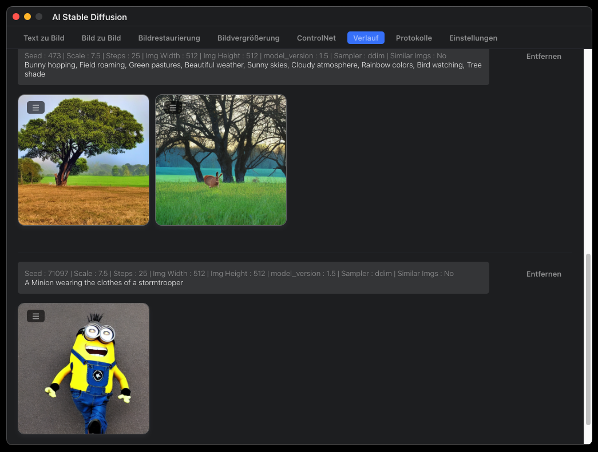
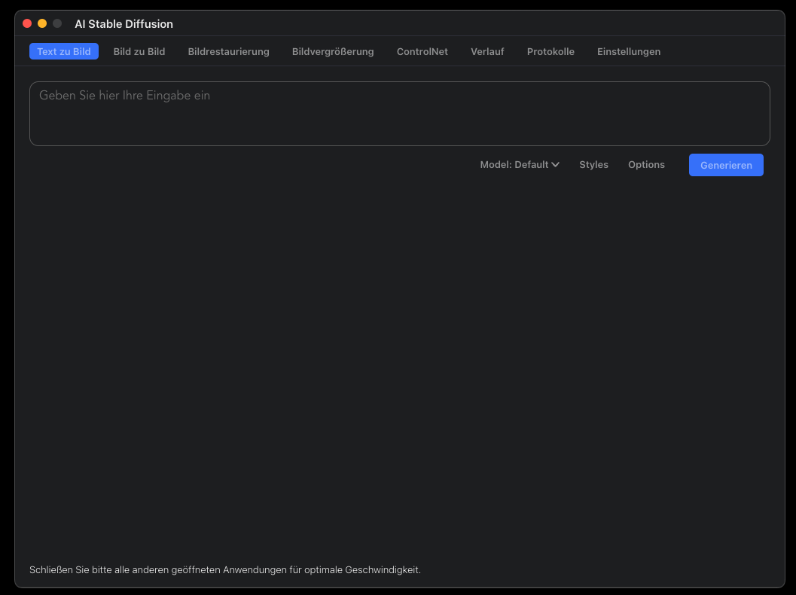
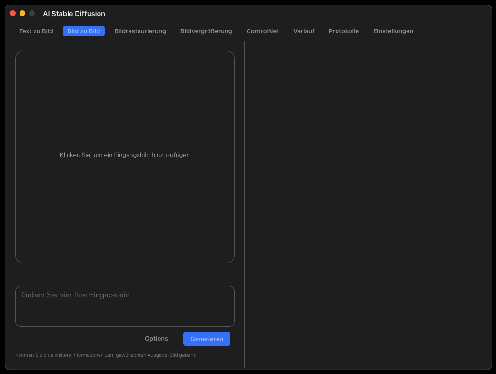
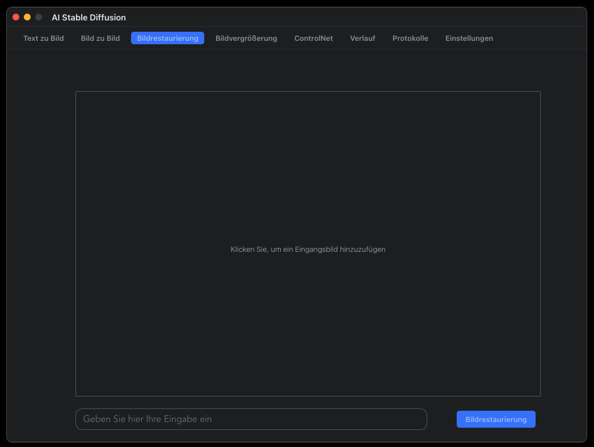
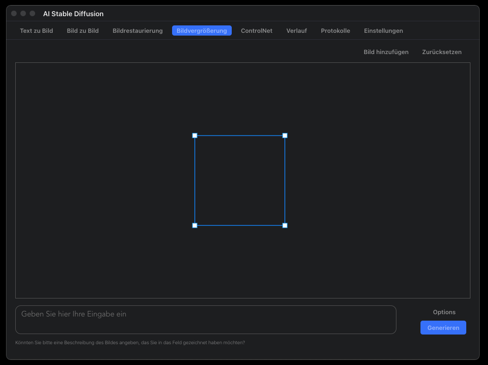

# AI Stable Diffusion

## Features
* Complete data privacy - no data is sent to the cloud (unless you choose to upload an image)
* User-friendly and intuitive UI with a one-click installer
* Image-to-image transformation
* In-painting capabilities
* Out-painting capabilities
* Generation history tracking
* Image upscaling functionality
* Support for multiple image sizes
* Optimized for M1/M2 chips (Apple silicon)
* Local execution on your own computer
* Support for negative prompts
* Advanced prompt options
* ControlNet integration

## Requirements 
* Mac with Intel or M1/M2 CPU
* Mac computers with Apple silicon or AMD GPUs
* For Intel-based Macs: macOS 12.0 or later
* For M1/M2-based Macs: macOS 12.0 or later
* Python 3.8 or later installed
* Xcode command-line tools: xcode-select --install

## Multi Languages supported: 
German, Turkish, Spanish, French, Italian

## Screenshot

